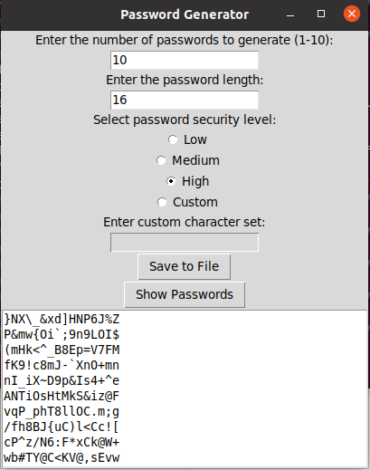

# Python Random Password Generator GUI

The Python Random Password Generator GUI is a user-friendly application built using Tkinter that allows you to generate secure passwords with customizable parameters.

## Features

- **Number of Passwords**: Specify the number of passwords to generate (1-10), with a default of 5.
- **Password Length**: Define the desired length of each password, with a default of 16 characters.
- **Security Level**: Choose from predefined security levels (Low, Medium, High) or define a custom character set for maximum flexibility.
- **Custom Character Set**: Enable and input your own set of characters for password generation when the "Custom" security level is selected.
- **Generate Passowrds** Button: Click to generate and display the passwords in a convenient text box.

## Usage

1. Clone the repository:

```bash
git clone https://github.com/Jonahida/python-random-pwd-generator-gui.git
```

2. Navigate to the project directory:

```bash
cd python-random-pwd-generator-gui
```

3. Run the application:

```bash
python main.py
```

## Screenshot




## Dependencies

- Python (>=3.6)
- Tkinter (Python GUI library)

## Contributing

Contributions are welcome! If you find any issues or have suggestions for improvements, feel free to open an issue or create a pull request.

## License

This project is licensed under the [MIT License](LICENSE).